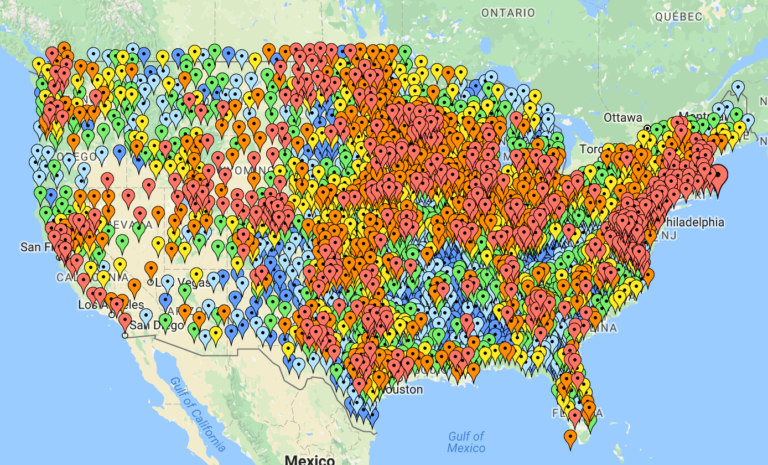
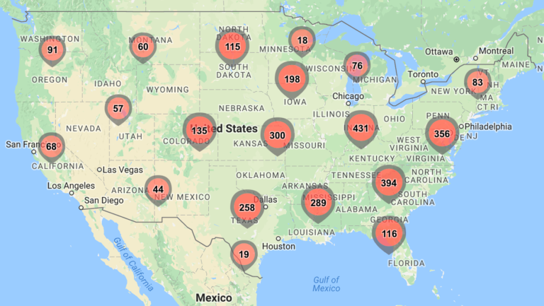
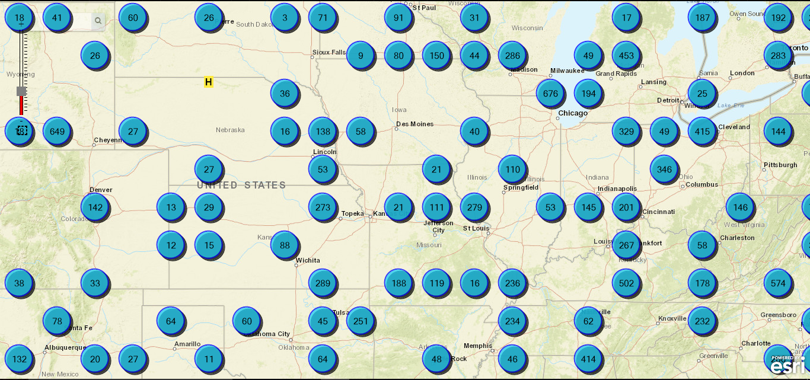
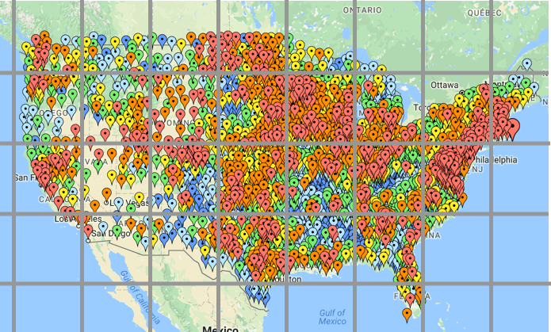
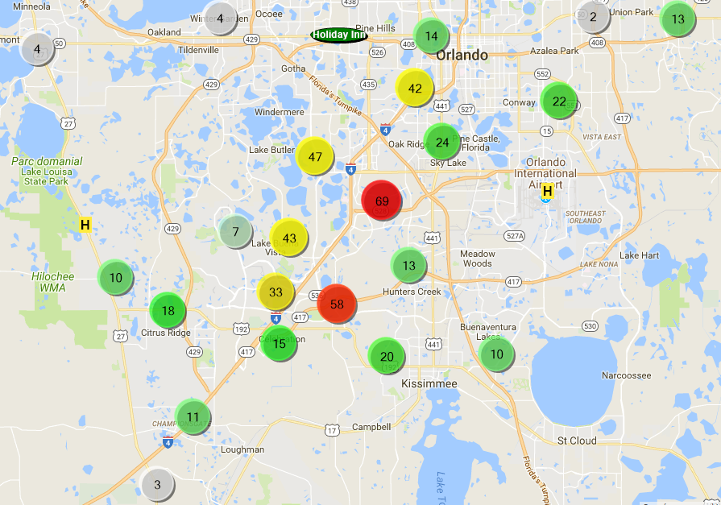
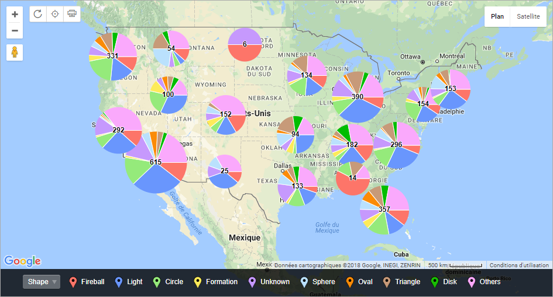
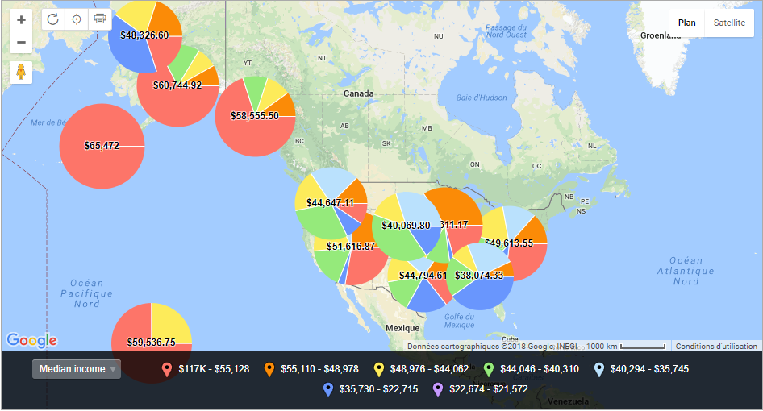

# Cluster Map

## 1. Definition

A cluster map helps represent dense pockets of data points using a single point. Each cluster is either relatively sized to or labelled with the number of points that have been grouped together.

Clusters are ideal in interactive maps where the user can drill down to see individual data points contained in a cluster. Cluster maps help reduce clutter when there are many overlapping data points in a small geography.

For example, to simplify the reading of the following map:

We could use the following cluster map to do the trick:

## 2. Variations

* **Natural**

Clusters have a natural appearance on the map. Location is used to control placement within the clustering grid. The original x,y map location of the cluster's founding data point is used for the location.

This is an example of natural clustering:

* **Grid**

The map is divided into squares of a certain size and the cluster marker is placed in the center of each applicable grid square. As zoom levels change, so do the clusters and their location on the map but they will maintain their grid-like appearance.

This is the intermediate step that uses a grid to create the clusters:

* **Different sizes and/or colors**

Different colors, shapes, and icons are useful for emphasizing clusters on the map. Clusters with a higher number count will stand out if given a larger size or a brighter color.

Here is a map where the color and the size of each cluster is proportional to the number of markers represented:

* **Pie charts**

Clusters can show the distribution of the different markers on a pie chart.

For example, here are clusters showing the number of UFO sightings in the USA, and pie charts representing the different UFO shapes seen:

* **Average value**

Cluters can show the average value of the clustered markers.

For example, here are clusters showing the average incomes in the USA, along with pie charts showing the incomes' distribution:

## 3. Sources

* [Definition](https://blog.socialcops.com/academy/resources/7-techniques-to-visualize-geospatial-data/)
* [Pictures before and after clustering, and grid cluster](http://blog.batchgeo.com/map-clustering-demo-tutorial/)
* [Cluster maps variations](http://maplarge.com/visual/clustering)
* [Pie chart clusters](https://batchgeo.com/features/map-clustering/)
