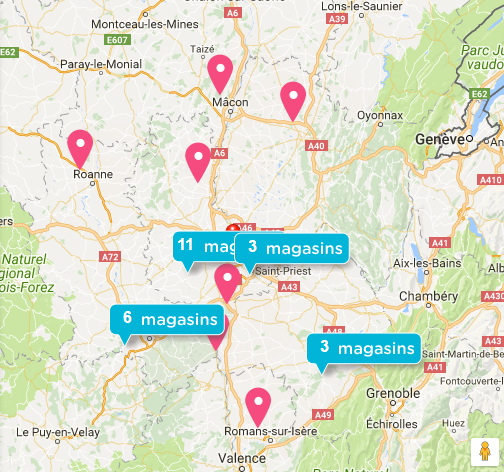

## Thibault Lecailtel - DataViz class @CentraleLyon - January 15th, 2018

# Cluster Map

## 1. Definition

A cluster map helps represent dense pockets of data points using a single point. Each cluster is either relatively sized to or labelled with the number of points that have been grouped together.

Clusters are ideal in interactive maps where the user can drill down to see individual data points contained in a cluster. Cluster maps help reduce clutter when there are many overlapping data points in a small geography. Often, the clusters are updated depending on the zoom chosen by the user.

For example, here is a map with hundreds of markers:

Instead, we use the following cluster map:

## 2. Recent example

There is no historical examples of cluster maps because these maps are often interactive and depending on several markers, thus they use recent technologies with clustering algorithms that did not exist a century ago.

However, there are lots of recent examples of cluster maps. They are especially used on the website of companies that have several stores on a territory.

For example, here is an extract of the cluster map representing the Carrefour stores in France on January 15th, 2018:

## 3. Design critic

I think clustering the markers is a great way of simplifying the maps.

The following picture, with hundreds of markers representing the Auchan stores in France, looks messy to me. Furthermore, Carrefour's cluster map has the advantage of showing the actual number of stores covered - which is impressive in the Paris area -, while the markers on Auchan's map are compressed and their number cannot be estimated.

## 4. Variations

* **Natural**

Clusters have a natural appearance on the map. Location is used to control placement within the clustering grid. The original x,y map location of the cluster's founding data point is used for the location.

This is an example of natural clustering:

* **Grid**

The map is divided into squares of a certain size and the cluster marker is placed in the center of each applicable grid square. As zoom levels change, so do the clusters and their location on the map but they will maintain their grid-like appearance.

This is the intermediate step that used a grid to create the clusters in the part 1:

* **Different sizes and/or colors**

Different colors and shapes are useful for emphasizing clusters on the map. Clusters with a higher number count will stand out if given a larger size or a brighter color.

Here is a map where the color and the size of each cluster is proportional to the number of markers represented:

* **Special icons**

Of coure, clusters are not always represented as circles or big pins.

Darty uses an icon close to their graphical charter on the cluster map that shows their stores in the Lyon area:

Bouygues Telecom prefers to use simple text labels as clusters:

* **Pie charts**

Clusters can show the distribution of the different markers on a pie chart.

For example, here are clusters showing the number of UFO sightings in 2015 in the USA, and pie charts representing the different UFO shapes seen:

* **Average value**

Cluters can show the average value of the clustered markers.

For example, here are clusters showing the average incomes in the USA, along with pie charts showing the incomes' distribution:

## 5. Different looks

Cluster maps can have various looks, using different colors, sizes, or shapes for the clusters.

For instance, a cluster map using only one style for all the clusters is, in my opinion, not really effective. The Carrefour cluster map in part 2 and the "natural" cluster map in part 3 are monotonous. Even though each cluster shows the number of markers it gathers, the difference between the clusters' sizes could be emphasized by different colors and/or different circle sizes.

## 6. Tools to create one

The most famous tool to create cluster maps is made by Google, and not surprisingly using Google Maps. The tool is called "Marker Clustering" and can be found [here](https://developers.google.com/maps/documentation/javascript/marker-clustering).

Here is what it can do - although I personnally am not a fan of the cluster icons used:

Other tools exist on the web. They are often coded in Javascript and can be easily found by typing "create cluster map" on a search engine.

## 7. Sources

* [Definition](https://blog.socialcops.com/academy/resources/7-techniques-to-visualize-geospatial-data/)
* [Pictures before and after clustering, and grid cluster](http://blog.batchgeo.com/map-clustering-demo-tutorial/)
* [Carrefour cluster map](https://www.carrefour.fr/magasin)
* [Auchan cluster map](https://www.auchan.fr/magasins/votremagasin)
* [Other cluster maps variations](http://maplarge.com/visual/clustering)
* [Darty cluster map](https://magasin.darty.com/fr/auvergne-rhone-alpes)
* [Bouygues Telecom cluster map](http://magasins.bouyguestelecom.fr/)
* [Pie chart cluster map](https://batchgeo.com/features/map-clustering/)
* [Google "marker clustering"](https://github.com/googlemaps/js-marker-clusterer/blob/gh-pages/screenshot.png)
